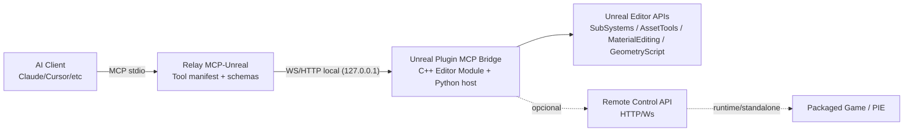
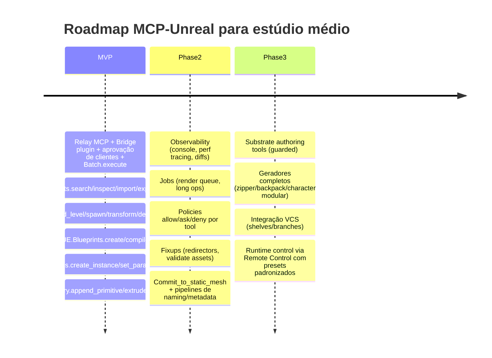

# Proposta detalhada para evoluir seu MCP do Unreal ao nível do Unity MCP 2.0

## Resumo executivo

O Unity MCP 2.0 (integrado ao pacote **Assistant** do Unity) é, na prática, um “produto de automação do Editor” com três diferenciais que fazem ele parecer “mágico” no dia a dia: (a) **um catálogo de ferramentas nativas** (tools) com **nomes estáveis**, **schemas JSON** e **ações padronizadas**; (b) **descoberta e registro automático** de ferramentas (incluindo custom tools) com ergonomia de manutenção muito boa; e (c) um modelo de **ponte/relay** que reduz atrito de integração com clientes MCP (Claude Code, Cursor etc.), incluindo aprovações, lista de ferramentas, toggles e logs. citeturn9search2turn9search1turn7view3turn8view0turn9search3

Para transformar seu MCP do Unreal em algo “igual ou superior”, a proposta mais robusta é não tentar “abstrair Python” de forma total, e sim: **padronizar Python (e C++ quando necessário) atrás de uma camada de ferramentas MCP de alto nível**, com contratos estáveis, idempotência, transações (undo/redo), batching e observabilidade. O objetivo é que o agente pare de “escrever script na mão” porque passa a ter **capabilities reutilizáveis** (as tools do seu MCP) — exatamente o salto que você percebeu ao olhar um “Unity-MCP-like”.

A recomendação arquitetural é um **MCP-Unreal em duas camadas**:

- **Camada Bridge in-editor (Unreal Plugin)**: um plugin (módulo Editor em C++ + componentes Python) que oferece uma API interna estável e segura para operações editoriais e pipeline. Essa camada usa as APIs oficiais do Unreal com preferência pelos **Editor Subsystems** (EditorActorSubsystem, LevelEditorSubsystem, EditorUtilitySubsystem etc.) e pelas bibliotecas editoriais (MaterialEditingLibrary, AssetTools, GeometryScript). citeturn21view0turn21view1turn11search0turn22search4turn23search17turn24search6  
- **Camada Relay MCP (processo externo)**: um processo “relay” que implementa MCP (stdio) e conversa com o plugin via WebSocket/HTTP local (ou named pipe). Isso espelha o modelo do Unity (relay binário + IPC local). citeturn9search2turn9search1

A partir daí, você publica um **catálogo de tools** parecidas com as do Unity (ManageScene/ManageAsset/RunCommand etc.), mas adaptadas ao Unreal e ao pipeline de estúdio (DCC + import/reimport + validação + render/capture). O que te deixa **superior ao Unity MCP** é: (1) incorporar **procedural geometry** via Geometry Script (DynamicMesh) e (2) incorporar um caminho claro para **runtime automation** via Remote Control (quando necessário) — mantendo o core no editor para produtividade. citeturn24search11turn24search6turn12search5turn4search2

---

## Unity MCP 2.0 como referência

### Arquitetura, primitives e ergonomia

O Unity MCP 2.0 é descrito como um servidor MCP “exposto” pelo editor, mas operacionalmente ele é dividido em dois processos:

1. **Unity Editor (MCP Bridge)** abre um canal IPC local (named pipes no Windows; Unix sockets no macOS/Linux). citeturn9search2  
2. O **relay binary** (instalado em `~/.unity/relay/`) é iniciado pelo cliente MCP com `--mcp` e atua como processo MCP server (stdio), conectando ao bridge via IPC e expondo ferramentas para o cliente. citeturn9search1turn9search2  

O fluxo de controle e descoberta é explicitamente documentado, incluindo:

- **Multi-client** (vários clientes MCP conectam ao mesmo Unity). citeturn9search2  
- **Aprovação de conexões**: conexões diretas requerem aprovação no Project Settings; conexões via AI Gateway são “trusted/auto-approved”. citeturn6search0turn9search3turn9search2  
- **UI de ferramentas**: lista de tools com enable/disable, debug logs e inspeção de estado (bridge running/stopped, connected/pending). citeturn9search1turn9search3  

### Registro e descoberta de ferramentas

O Unity MCP fornece um modelo de tool registry e schemas para guiar o LLM:

- O `McpToolRegistry` faz scan de assemblies via `TypeCache` e registra tools automaticamente no startup. citeturn7view3  
- Há **quatro abordagens** de registro: método estático tipado, método estático com `JObject` (schema custom/dinâmico), tool class-based (stateful) e API runtime (registrar/desregistrar em runtime). citeturn7view3  
- Há suporte formal de **output schema** via atributos (ex.: `McpOutputSchemaAttribute`). citeturn15search15  

Isso é o que dá a “sensação Unity MCP 2.0”: o agente não “chuta” parâmetros — ele descobre tools e segue schemas.

### Catálogo de tools built-in e padrões de workflow

O Unity MCP 2.0 lista explicitamente as tool classes built-in no namespace `Unity.AI.MCP.Editor.Tools`. citeturn8view0  
Essas tools se comportam como “endpoints” MCP e se organizam em padrões repetíveis:

- **Um tool name estável** (ex.: `Unity.ManageGameObject`)  
- **Um parâmetro `action`/`Action`** que define a operação (create/find/modify etc.)  
- **Retorno padronizado** com `success/message/data` (varia por tool, mas a intenção é uniforme) citeturn7view2turn15search0turn15search1  

Ferramentas built-in enumeradas em doc:

- `Unity.ApplyTextEdits` (edições pontuais por range/linha/coluna, com pré-condição SHA). citeturn15search8  
- `Unity.ScriptApplyEdits` (edições estruturadas por método/classe, anchor ops e validação). citeturn15search3  
- `Unity.RunCommand` (compilar/executar C# no editor; “power tool”). citeturn15search2turn15search6  
- `Unity.ManageAsset` (CRUD/import/rename/move/search etc.). citeturn15search1  
- `Unity.ManageScene` (load/save/create/get hierarchy etc.). citeturn15search0turn15search9  
- `Unity.ManageGameObject` (CRUD/find + operações de componentes com serialização). citeturn7view2  
- `Unity.ReadConsole` (get/clear logs). citeturn7view0turn6search3  
- `Unity.ResourceTools` (wrappers para listar/ler recursos com lógica de path safety). citeturn7view0  
- Outras: `CreateScript`, `DeleteScript`, `GetSHA`, `ImportExternalModel`, `ManageEditor`, `ManageMenuItem`, `ManageScript`, `ManageShader`, `ManageScriptCapabilities`, `ValidateScript`. citeturn8view0  

**Ergonomia “de produto”**: além do catálogo, existe um processo de setup e troubleshooting voltado a usuários: ver bridge running, instalar relay, configurar clientes suportados via “Integrations”, exigir `--mcp`, e mostrar claramente causas de falhas (tools not discovered, relay missing, compilation errors). citeturn9search1turn9search3

---

## Inventário de capacidades nativas do Unreal que funcionam como base para um MCP

A diferença fundamental: no Unreal você tem APIs editoriais excelentes, mas elas não vêm “empacotadas” como um catálogo MCP de alto nível por padrão. O trabalho é justamente “empacotar e estabilizar” essas APIs.

### Scripting e automação no Editor com Python e Subsystems

O Unreal expõe muitas operações editoriais via Python, e o caminho moderno tende a ser **SubSystems**.

- `unreal.EditorActorSubsystem`: utilitários de atores (seleção, duplicar, destruir, referência por path, eventos editoriais). citeturn21view0  
- `unreal.LevelEditorSubsystem`: funções do Level Editor (play simulate/end play, load/new level, build lightmaps, seleção via TypedElementSelectionSet). citeturn21view1  
- `unreal.EditorUtilitySubsystem`: suporte a Editor Utility Widgets (spawn/register tab etc.). citeturn11search0  

Um ponto crítico para roadmap: várias funções antigas estavam no `EditorLevelLibrary` e aparecem como **deprecated**, com recomendação explícita para migrar para Subsystems (Editor Actor Utilities, Level Editor Subsystem etc.). Isso sinaliza que um MCP-Unreal moderno deve “falar subsystem-first” e esconder a fragmentação por trás de uma API estável. citeturn20view0

Para assets, o `EditorAssetLibrary` documenta limitações e custos:

- “All operations can be slow.”  
- “The editor should not be in play in editor mode.”  
- “It will not work on assets of the type level.” citeturn19search2  

Isso impacta diretamente design de batching, timeouts e UX do seu MCP.

### Blueprint authoring e edição com Python

O Unreal tem suporte Python específico para Blueprints:

- `unreal.BlueprintEditorLibrary` faz operações como `create_blueprint_asset_with_parent`, `add_member_variable`, `compile_blueprint`, `find_event_graph`, etc. citeturn25search3turn25search32  
- `unreal.EditorUtilityLibrary` permite recuperar seleção de assets/blueprints etc., útil para interação contextual no editor. citeturn25search2  

Há também nuances práticas: a integração Python↔Blueprint pode exigir estratégias (expor hooks via C++/BlueprintImplementableEvent, ou usar reflexão/funções BlueprintCallable) dependendo do que você quer automatizar. citeturn25search24turn4search2  

### Materiais e Substrate

Para materiais “clássicos” (graph + instances), existe base oficial para editar via Python:

- `unreal.MaterialEditingLibrary` permite criar expressions, conectar expressions e conectar a propriedades do material (BaseColor/Opacity etc.), deletar nodes e recompilar. citeturn22search4  

Substrate é um ponto-chave para você (“jeito moderno”): ele foi introduzido como um novo framework de authoring de materiais com enfoque modular/multi-lobe e é tratado como experimental na introdução. citeturn12search5turn12search2  
Isso implica que, numa proposta “MCP-Unreal superior”, você deve:

1. Ter **tools de materials** que funcionam tanto em “legacy materials” quanto em projetos com Substrate habilitado.  
2. Isolar o risco: Substrate exige gates (feature flags) e validações mais fortes, porque sua estabilidade/performance e o ecossistema de tooling são mais sensíveis a versão. citeturn12search5turn22search6  

### Procedural geometry com Geometry Script

Aqui está uma vantagem competitiva grande: Geometry Script (DynamicMesh + libraries) já expõe muitas operações em API “toolable”:

- Primitivas: `unreal.GeometryScript_Primitives.append_box`, `append_sphere_lat_long`, extrusões simples, etc. citeturn24search11  
- Modelagem: `unreal.GeometryScript_MeshModeling.apply_mesh_linear_extrude_faces`, inset/outset, shell, bevel etc. citeturn24search6  
- Normais/Tangentes: `unreal.GeometryScript_Normals.recompute_normals`, `compute_tangents` etc. citeturn24search2  
- UVs: `unreal.GeometryScript_UVs.set_mesh_u_vs_from_planar_projection`, `set_num_uv_sets` etc. citeturn24search5  
- Edição de buffers: `unreal.GeometryScript_MeshEdits.add_triangles_to_mesh`, `set_all_mesh_vertex_positions` etc. citeturn24search12  

Um MCP “procedural-first” para geradores (characters/modulares, zíperes, mochilas) pode ganhar muito produtividade ao encapsular essas bibliotecas como tools de alto nível.

### Import, reimport, export e rendering/capture

Para import/export:

- `unreal.AssetImportTask` e `unreal.AutomatedAssetImportData` são estruturas oficializadas para batch import e automação de import com opções e controle de overwrite. citeturn23search1turn23search2turn23search28  
- `unreal.AssetToolsHelpers.get_asset_tools()` dá acesso ao AssetTools, que inclui `export_assets` e operações de criação/duplicação. citeturn23search0turn23search17  

Para capture/render:

- `unreal.MoviePipelineQueueSubsystem` (Editor) gerencia a fila do Movie Render Queue e executores. citeturn23search10  
- `unreal.MoviePipelineQueueEngineSubsystem` é citado como subsistema voltado a runtime/shipping (ainda que útil em PIE). citeturn23search3  

### Remote Control API para exposição externa

Remote Control tem papel importante no seu MCP por dois motivos: (1) exposição externa padronizada (HTTP/WebSocket), e (2) caminho para automação que não depende só de “rodar python na máquina”.

A documentação visível via buscas descreve que:

- Há um endpoint `PUT /remote/object/call` para **chamar uma função exposta** em um `UObject` especificado, e uma rota para leitura/escrita de propriedades (`remote/object/property`). citeturn4search2turn14search1  
- Na prática, a comunidade usa esse endpoint com payload contendo `objectPath`, `functionName`, `parameters` e (em alguns casos) `generateTransaction`. citeturn4search26turn14search2  
- Há nuances no runtime/PIE: paths mudam com prefixos como `UEDPIE_0_`, e há requisitos de configuração/flags para standalone/packaged em alguns cenários. citeturn14search0  

---

## Comparação Unity MCP 2.0 e Unreal com equivalências e lacunas

### Tabela comparativa de alto nível

| Feature no Unity MCP 2.0 | Equivalente direto no Unreal | Gap principal | Recomendação MCP-Unreal |
|---|---|---|---|
| Tool registry + schemas (descoberta) citeturn7view3turn15search15 | APIs Python/C++ dispersas (SubSystems, libraries) citeturn21view0turn21view1turn22search4 | Falta “catálogo estável” e schemas para LLM | Criar **Tool Registry** próprio no plugin, com schemas JSON versionados e grupos (core/assets/scene/…) |
| UX de conexão: relay + aprovação + toggles citeturn9search1turn9search3 | Remote Control tem server HTTP/Ws e configs, mas foco é controle remoto e não “catálogo MCP” citeturn4search2turn14search0 | Falta uma UX integrada de MCP (aprovação de cliente, lista de tools, debug logs) | Implementar “MCP Settings Panel” no Unreal (Editor Utility Widget + C++ settings) |
| Scene/GameObject management (`ManageScene`, `ManageGameObject`) citeturn15search0turn7view2 | `EditorActorSubsystem`, `LevelEditorSubsystem`, `EditorLevelLibrary` (com deprecações) citeturn21view0turn21view1turn20view0 | Fragmentação e mudanças de API entre versões | MCP-Unreal deve expor **operações estáveis** (spawn/find/transform/selection) e esconder “quem faz” (Subsystem vs Library) |
| Asset management (`ManageAsset`) citeturn15search1 | `EditorAssetLibrary`, `AssetTools`, `AssetImportTask` citeturn19search2turn23search17turn23search1 | Performance/slow ops + limites em PIE + necessidade de batching | Tool `UE.Assets.batch` + `UE.Assets.search` + `UE.Assets.import` com job queue |
| Script execution (`RunCommand`) citeturn15search2 | Não existe “executar C++ arbitrário” com segurança; Python é editor-only; compile C++ é pipeline pesado citeturn16search6turn20view0 | Falta um “super tool” equivalente com sandbox | Sustituir com “intents” seguras: Blueprints edit/compile, assets ops, geometry ops. Opcional: `UE.Sandbox.run_python` restrito e auditado |
| Structured code edits (`ScriptApplyEdits`) citeturn15search3 | Blueprints editáveis por API, mas “edição textual” do C++ não é parte do Unreal; depende de toolchain externo | Dificuldade de edição/compilação de C++ dentro do loop MCP | Focar em: (1) Blueprints edit/compile; (2) templates C++ + geração guiada; (3) integração com IDE/CI para compile |
| Procedural geometry (não é core no Unity MCP) | Geometry Script expõe operações poderosas (extrude/UVs/normals/mesh edits) citeturn24search6turn24search11turn24search12 | Falta “tool de alto nível” para casos comuns (zíper/mochila/character parts) | Tornar Geometry Script um **domínio MCP de primeira classe**: `UE.Geometry.*` + bibliotecas de geradores |

### Lacunas mais importantes para você atacar

**Lacuna de ergonomia (LLM-friendly)**: Unity MCP descreve ferramentas com schemas + enum actions e organiza o uso por workflows (ex.: primeiro `ReadConsole`, depois `ScriptApplyEdits`, depois `ValidateScript`). citeturn15search8turn15search3turn6search3  
No Unreal, a mesma capacidade existe, mas o agente precisa conhecer classes e detalhes (SubSystems + paths + tipos). Isso explica por que, no seu MCP atual, o agente ainda “escreve script python na mão”: falta uma camada de **intents nomeadas** que encapsule o “como”.

**Lacuna de segurança e auditoria**: Unity MCP tem conceito de aprovação do cliente e ferramentas habilitadas/desabilitadas. citeturn6search0turn9search3  
No Unreal, você precisa construir isso no seu plugin/relay (auth + allowlist + auditoria por tool).

**Lacuna de estabilidade entre versões**: o próprio `EditorLevelLibrary` marca funções como deprecated e direciona a novos subsystems. citeturn20view0  
Isso exige que seu MCP-Unreal vire uma “camada de compatibilidade” para o estúdio: você versiona tools, não scripts.

---

## Proposta de API do MCP-Unreal

### Princípios de design para um MCP-Unreal “Unity-like”

1. **Tools são contratos, não scripts**: o agente chama `UE.Scene.spawn_actor`, não “roda python para spawnar”.  
2. **Schemas JSON ricos**: mesmo quando a implementação usa Python, a interface é estável e tipada.  
3. **Idempotência e transações**:
   - Toda tool aceita `request_id` e opcionalmente `idempotency_key`.  
   - Operações destrutivas suportam `dry_run` e `transaction=true` (undo/redo).  
4. **Batch como first-class**: inspirado em “execute múltiplas ações” para performance (o próprio `EditorAssetLibrary` alerta sobre lentidão). citeturn19search2  
5. **Observabilidade completa**: console/logs, seleção atual, assets tocados, diffs, captura de viewport, métricas de tempo por tool.  
6. **Implementação híbrida guiada por custo/risco**:
   - Python para MVP/editor ops rápidas.  
   - C++ Editor Module quando precisar confiabilidade, performance, hooks profundos, e UI nativa.  
   - Remote Control para cenários remotos/runtime.

### Convenções de contrato

**Campos comuns de request (todas as tools)**

- `request_id: string` (obrigatório)  
- `idempotency_key?: string`  
- `dry_run?: boolean`  
- `transaction?: { enabled: boolean, label?: string }`  
- `timeout_ms?: number`  
- `trace?: { correlation_id?: string, client?: string }`

**Resposta padrão**

- `ok: boolean`  
- `data?: any`  
- `warnings?: [{code, message, details?}]`  
- `error?: { code: string, message: string, details?: any, retryable?: boolean }`  
- `meta: { duration_ms, engine_version?, project?, touched_assets?: [path], touched_levels?: [path] }`

**Códigos de erro comuns**

- `E_INVALID_ARGUMENT`, `E_NOT_FOUND`, `E_ACCESS_DENIED`, `E_CONFLICT`, `E_TIMEOUT`, `E_ENGINE_BUSY`, `E_UNSUPPORTED`, `E_INTERNAL`  

### Catálogo completo de tools propostas por domínio

A seguir, o catálogo proposto para “MVP + Phase2 + Phase3”. A ideia é que seu MCP tenha uma lista tão clara quanto a do Unity (ManageScene/ManageAsset/RunCommand etc.), mas adaptada ao Unreal.

> Nota de implementação: “Python” abaixo assume uso das APIs oficiais (`unreal.*`) com preferência por SubSystems (EditorActorSubsystem, LevelEditorSubsystem), MaterialEditingLibrary, AssetTools/ImportTask e GeometryScript. citeturn21view0turn21view1turn22search4turn23search17turn24search11

#### Domínio de sessão e projeto

| Tool | Prioridade | Idempotência | Parâmetros específicos | Retorno `data` | Implementação recomendada |
|---|---|---|---|---|---|
| `UE.Session.ping` | MVP | Sim | — | `{engine_version, project_name, project_path, editor_state}` | C++ (rápido) |
| `UE.Session.get_context` | MVP | Sim | `include_selection?`, `include_open_assets?` | `{active_level, selection, open_editors}` | Python + Subsystems citeturn21view1turn21view0 |
| `UE.Session.set_mode` | Phase2 | Sim | `mode: "safe"|"normal"|"unsafe"` | `{mode}` | C++ + settings |
| `UE.Session.begin_transaction` | MVP | Sim (por key) | `label` | `{tx_id}` | Python (`ScopedEditorTransaction`) + C++ fallback |
| `UE.Session.end_transaction` | MVP | Sim | `tx_id`, `commit:boolean` | `{committed}` | idem |
| `UE.Batch.execute` | MVP | Sim (por item) | `ops:[{tool, args}]`, `fail_fast?` | `{results:[…]}` | C++ orchestration + Python executors |

#### Asset management

| Tool | Prioridade | Idempotência | Parâmetros específicos | Retorno `data` | Implementação recomendada |
|---|---|---|---|---|---|
| `UE.Assets.search` | MVP | Sim | `query`, `path?`, `class?`, `limit?` | `{assets:[{path,class,name}]}` | Python (AssetRegistry + EditorAssetLibrary) citeturn19search2turn23search17 |
| `UE.Assets.inspect` | MVP | Sim | `asset_path`, `include_deps?` | `{metadata, deps, refs}` | Python |
| `UE.Assets.create_folder` | MVP | Sim | `folder_path` | `{created}` | Python |
| `UE.Assets.duplicate` | MVP | Sim (por key) | `src_path`, `dst_path` | `{dst_path}` | Python (AssetTools) citeturn23search17 |
| `UE.Assets.move` | MVP | Sim (por key) | `src_path`, `dst_path` | `{dst_path}` | Python |
| `UE.Assets.rename` | MVP | Sim (por key) | `asset_path`, `new_name` | `{new_path}` | Python |
| `UE.Assets.delete` | Phase2 | Sim (por key) | `asset_paths`, `force?` | `{deleted:[…]}` | Python + confirmations |
| `UE.Assets.save` | MVP | Sim | `asset_paths` | `{saved:[…]}` | Python |
| `UE.Assets.checkout` | Phase2 | Sim | `asset_paths` | `{checked_out:[…]}` | Python (EditorAssetLibrary has checkout ops) citeturn19search2 |
| `UE.Assets.fixup_redirectors` | Phase2 | Sim | `path` | `{fixed}` | Python/C++ |
| `UE.Assets.validate` | Phase2 | Sim | `scope:{path|assets}` | `{issues:[…]}` | Python (EditorValidatorSubsystem) citeturn16search16 |

#### Scene e atores

| Tool | Prioridade | Idempotência | Parâmetros específicos | Retorno `data` | Implementação recomendada |
|---|---|---|---|---|---|
| `UE.Scene.load_level` | MVP | Sim (por path) | `level_asset_path` | `{loaded}` | Python (LevelEditorSubsystem.load_level) citeturn21view1 |
| `UE.Scene.new_level` | Phase2 | Sim | `level_asset_path`, `partitioned?` | `{created}` | Python (LevelEditorSubsystem.new_level) citeturn21view1 |
| `UE.Scene.save_level` | MVP | Sim | `level?:"current" \| path` | `{saved}` | Python (Level Editor / editor API) |
| `UE.Scene.list_actors` | MVP | Sim | `class?`, `label_query?`, `limit?` | `{actors:[{path,label,class}]}` | Python (EditorActorSubsystem + world iteration) citeturn21view0 |
| `UE.Scene.find_actor` | MVP | Sim | `by:"path"\|"label"`, `value` | `{actor_path}` | Python (get_actor_reference) citeturn21view0 |
| `UE.Scene.spawn_actor` | MVP | Sim (por key) | `class_path|blueprint_path`, `transform`, `label?` | `{actor_path}` | Python (EditorActorSubsystem) + C++ fallback citeturn21view0 |
| `UE.Scene.duplicate_actor` | MVP | Sim (por key) | `actor_path`, `offset?` | `{new_actor_path}` | Python (duplicate_actor) citeturn21view0 |
| `UE.Scene.destroy_actor` | MVP | Sim (por key) | `actor_path` | `{destroyed}` | Python (destroy_actor) citeturn21view0 |
| `UE.Scene.set_actor_transform` | MVP | Sim (por key) | `actor_path`, `transform`, `space?` | `{transform}` | Python |
| `UE.Scene.get_selection` | MVP | Sim | — | `{selected_actor_paths:[…]}` | Python (LevelEditorSubsystem selection set) citeturn21view1turn21view0 |
| `UE.Scene.set_selection` | Phase2 | Sim | `actor_paths` | `{selected}` | Python |
| `UE.Scene.build_lightmaps` | Phase3 | Não (job) | `quality`, `with_reflection_captures?` | `{job_id}` | Python (LevelEditorSubsystem.build_light_maps) citeturn21view1 |

#### Blueprints

| Tool | Prioridade | Idempotência | Parâmetros específicos | Retorno `data` | Implementação recomendada |
|---|---|---|---|---|---|
| `UE.Blueprints.create` | MVP | Sim (por key) | `asset_path`, `parent_class` | `{bp_path}` | Python (BlueprintEditorLibrary.create_blueprint_asset_with_parent) citeturn25search3 |
| `UE.Blueprints.compile` | MVP | Sim | `bp_path` | `{compiled}` | Python (BlueprintEditorLibrary.compile_blueprint) citeturn25search3 |
| `UE.Blueprints.add_variable` | Phase2 | Sim (por key) | `bp_path`, `name`, `type` | `{added}` | Python (add_member_variable) citeturn25search3turn25search11 |
| `UE.Blueprints.get_graph` | Phase2 | Sim | `bp_path`, `graph:"EventGraph"\|name` | `{graph_id}` | Python (find_event_graph/find_graph) citeturn25search32 |
| `UE.Blueprints.call_function` | MVP | Não (side effects) | `object_path`, `function_name`, `parameters` | `{return?}` | Preferir **Remote Control** em runtime; no editor usar reflexão + wrappers citeturn4search2turn14search2 |
| `UE.Blueprints.set_defaults` | Phase2 | Sim (por key) | `bp_path`, `defaults_patch` | `{applied}` | Python (CDO edit + compile) |
| `UE.Blueprints.open_editor` | Phase3 | Sim | `bp_path` | `{opened}` | C++ Editor integration |

#### Materiais e Substrate

| Tool | Prioridade | Idempotência | Parâmetros específicos | Retorno `data` | Implementação recomendada |
|---|---|---|---|---|---|
| `UE.Materials.create_material` | MVP | Sim (por key) | `asset_path`, `template?` | `{material_path}` | Python (AssetTools + MaterialEditingLibrary) citeturn22search4turn23search17 |
| `UE.Materials.create_instance` | MVP | Sim (por key) | `parent_material_path`, `instance_path` | `{instance_path}` | Python (AssetTools) |
| `UE.Materials.set_instance_params` | MVP | Sim | `instance_path`, `scalars?`, `vectors?`, `textures?` | `{applied}` | Python (MaterialEditingLibrary + MI APIs) citeturn22search4turn22search1 |
| `UE.Materials.build_graph` | Phase2 | Sim (por key) | `material_path`, `nodes`, `connections`, `layout?` | `{built}` | Python (create_material_expression/connect) citeturn22search4 |
| `UE.Materials.compile` | MVP | Sim | `material_path` | `{compiled}` | Python (recompile_material) citeturn22search4 |
| `UE.Materials.get_stats` | Phase2 | Sim | `material_path` | `{stats}` | Python (get_statistics) citeturn22search4 |
| `UE.Materials.substance_substrate_enable_check` | MVP | Sim | — | `{substrate_enabled, notes}` | C++ (project settings) + docs guidance citeturn12search5turn12search2 |
| `UE.Materials.create_substrate_glass` | Phase3 | Sim (por key) | `asset_path`, `params` | `{material_path}` | C++ (mais seguro) + Python builder opcional (alto risco) citeturn12search5turn22search6 |

#### Procedural geometry e geradores

| Tool | Prioridade | Idempotência | Parâmetros específicos | Retorno `data` | Implementação recomendada |
|---|---|---|---|---|---|
| `UE.Geometry.create_mesh` | MVP | Sim (por key) | `mesh_type:"DynamicMesh"`, `name?` | `{mesh_id}` | Python |
| `UE.Geometry.append_primitive` | MVP | Sim (por key) | `mesh_id`, `primitive:"box"|"sphere"|…`, `params`, `transform` | `{mesh_id}` | Python (GeometryScript_Primitives) citeturn24search11 |
| `UE.Geometry.extrude_faces` | MVP | Sim (por key) | `mesh_id`, `selection?`, `distance`, `direction_mode?` | `{mesh_id}` | Python (GeometryScript_MeshModeling) citeturn24search6turn11search3 |
| `UE.Geometry.uv_planar_project` | MVP | Sim | `mesh_id`, `uv_set`, `plane_transform` | `{mesh_id}` | Python (GeometryScript_UVs) citeturn24search5 |
| `UE.Geometry.recompute_normals` | MVP | Sim | `mesh_id`, `options` | `{mesh_id}` | Python (GeometryScript_Normals) citeturn24search2 |
| `UE.Geometry.commit_to_static_mesh` | Phase2 | Sim (por key) | `mesh_id`, `asset_path`, `build_settings?` | `{static_mesh_path}` | C++/Python (depende pipeline) |
| `UE.Generators.zipper.generate` | Phase2 | Sim (por key) | `spec:{length, teeth, profile…}` | `{mesh_path, metadata}` | Python GeometryScript + blueprint assembly |
| `UE.Generators.backpack.generate` | Phase3 | Sim (por key) | `spec:{body, straps, pockets…}` | `{assets_created:[…]}` | Mistura GeometryScript + Materials + Prefab/Blueprint |
| `UE.Generators.character_modular.assemble` | Phase3 | Sim (por key) | `parts`, `skeleton?`, `lods?` | `{bp_path, meshes}` | C++/Python (alto risco) |

#### Import/export e interoperabilidade com DCC

| Tool | Prioridade | Idempotência | Parâmetros específicos | Retorno `data` | Implementação recomendada |
|---|---|---|---|---|---|
| `UE.Import.import_assets` | MVP | Não (job) | `files:[…]`, `destination_path`, `options`, `replace_existing?` | `{imported_paths:[…]}` | Python (AssetImportTask/AutomatedImport) citeturn23search1turn23search28 |
| `UE.Import.reimport_asset` | Phase2 | Não (job) | `asset_path`, `new_source?` | `{reimported}` | Python (depende asset type; pode exigir C++) |
| `UE.Export.export_assets` | MVP | Não | `asset_paths`, `output_dir` | `{exported_files:[…]}` | Python (AssetTools.export_assets) citeturn23search17 |
| `UE.DCC.send_to_blender` | Phase3 | Não | `asset_paths`, `format` | `{job_id}` | Externo (pipeline) |
| `UE.DCC.receive_from_maya` | Phase3 | Não | `watch_dir` | `{job_id}` | Externo (pipeline) |

#### Playtest, capture e render

| Tool | Prioridade | Idempotência | Parâmetros específicos | Retorno `data` | Implementação recomendada |
|---|---|---|---|---|---|
| `UE.Playtest.play_simulate` | MVP | Não | `viewport?` | `{started}` | Python (LevelEditorSubsystem.editor_play_simulate) citeturn21view1 |
| `UE.Playtest.stop` | MVP | Sim | — | `{stopped}` | Python (editor_request_end_play) citeturn21view1 |
| `UE.Render.queue_submit` | Phase2 | Não (job) | `jobs:[{sequence, config,…}]` | `{executor_id}` | Python (MoviePipelineQueueSubsystem) citeturn23search10 |
| `UE.Render.runtime_queue_submit` | Phase3 | Não (job) | `jobs` | `{job_id}` | Python (MoviePipelineQueueEngineSubsystem) citeturn23search3 |
| `UE.Capture.viewport_image` | Phase2 | Não | `resolution`, `camera?` | `{image_path}` | C++ (mais previsível) |

#### Observabilidade, diagnóstico e segurança

| Tool | Prioridade | Idempotência | Parâmetros específicos | Retorno `data` | Implementação recomendada |
|---|---|---|---|---|---|
| `UE.Obs.read_console` | MVP | Sim | `limit?`, `levels?` | `{entries:[…]}` | Python (log harvesting) |
| `UE.Obs.profile_last_ops` | Phase2 | Sim | — | `{ops:[{tool,duration_ms,…}]}` | C++/relay |
| `UE.Security.approve_client` | MVP | Sim | `client_id`, `scopes` | `{approved}` | C++ settings panel (Unity-like) citeturn9search3 |
| `UE.Security.set_tool_policy` | Phase2 | Sim | `tool`, `policy:"allow"|"ask"|"deny"` | `{policy}` | C++ + config |
| `UE.Errors.explain_last_failure` | Phase2 | Sim | `request_id` | `{analysis}` | Relay (melhora UX) |

---

### APIs críticas do MVP com exemplos de payload e implementação

Abaixo estão 10 APIs do MVP que normalmente dão o maior ganho “Unity-MCP-like”: assets, cena/atores, blueprint compile, materiais, import e batch.

#### `UE.Assets.search`

**Payload (exemplo)**

```json
{
  "request_id": "req-001",
  "query": "MI_Glass",
  "path": "/Game/Materials",
  "class": "MaterialInstanceConstant",
  "limit": 20
}
```

**Implementação Python (núcleo)** (baseado em `EditorAssetLibrary`, que é utilitário de Content Browser) citeturn19search2

```python
import unreal

def assets_search(query: str, path="/Game", asset_class=None, limit=50):
    # Obs: EditorAssetLibrary é utilitário do Content Browser; operações podem ser lentas.
    assets = unreal.EditorAssetLibrary.list_assets(path, recursive=True, include_folder=False)
    out = []
    for a in assets:
        if query.lower() not in a.lower():
            continue
        data = unreal.EditorAssetLibrary.find_asset_data(a)
        if asset_class and data.asset_class != asset_class:
            continue
        out.append({"path": a, "class": data.asset_class, "name": data.asset_name})
        if len(out) >= limit:
            break
    return out
```

**Implementação C++ (esqueleto)**  
Recomendação: expor essa operação em um `UEditorSubsystem` ou handler interno do seu plugin e chamar AssetRegistry/EditorAssetLibrary internamente (melhor performance e menos overhead Python para listas grandes).

#### `UE.Scene.spawn_actor`

**Payload**

```json
{
  "request_id": "req-010",
  "idempotency_key": "spawn:BP_Crate:/Game/Maps/Main",
  "class_path": "/Game/Blueprints/BP_Crate.BP_Crate_C",
  "transform": { "location": [0,0,100], "rotation": [0,0,0], "scale": [1,1,1] },
  "label": "Crate_01",
  "transaction": { "enabled": true, "label": "Spawn Crate_01" }
}
```

**Implementação Python (núcleo)** usando `EditorActorSubsystem` citeturn21view0

```python
import unreal

def scene_spawn_actor(actor_class, location, rotation, scale, label=None):
    eas = unreal.get_editor_subsystem(unreal.EditorActorSubsystem)
    world = unreal.EditorLevelLibrary.get_editor_world()  # ok, mas prefira o UnrealEditorSubsystem em versões novas
    # Você pode usar factories/spawn utilities dependendo do tipo. Aqui fica um exemplo simplificado:
    actor = unreal.EditorLevelLibrary.spawn_actor_from_class(actor_class, unreal.Vector(*location), unreal.Rotator(*rotation))
    if actor and label:
        actor.set_actor_label(label)
    actor.set_actor_scale3d(unreal.Vector(*scale))
    return actor
```

> Observação: escolher a melhor API de spawn varia por versão; seu MCP deve encapsular isso e manter estável. citeturn20view0turn21view0

#### `UE.Scene.set_actor_transform`

**Payload**

```json
{
  "request_id": "req-011",
  "actor_path": "PersistentLevel.Crate_01",
  "transform": { "location": [200,0,100], "rotation": [0,45,0], "scale": [1,1,1] },
  "transaction": { "enabled": true, "label": "Move Crate_01" }
}
```

**Implementação Python (núcleo)**

- Resolver actor via `get_actor_reference` e aplicar transform.

```python
import unreal

def scene_set_actor_transform(actor_path, loc, rot, scale):
    eas = unreal.get_editor_subsystem(unreal.EditorActorSubsystem)
    actor = eas.get_actor_reference(actor_path)
    if not actor:
        raise RuntimeError(f"Actor not found: {actor_path}")
    actor.set_actor_location(unreal.Vector(*loc), False, True)
    actor.set_actor_rotation(unreal.Rotator(*rot), False)
    actor.set_actor_scale3d(unreal.Vector(*scale))
```

#### `UE.Blueprints.compile`

**Payload**

```json
{
  "request_id": "req-020",
  "bp_path": "/Game/Blueprints/BP_Crate"
}
```

**Implementação Python** via `BlueprintEditorLibrary.compile_blueprint` citeturn25search3

```python
import unreal

def bp_compile(bp_path: str):
    bp = unreal.EditorAssetLibrary.load_asset(bp_path)
    unreal.BlueprintEditorLibrary.compile_blueprint(bp)
    return True
```

#### `UE.Materials.create_instance`

**Payload**

```json
{
  "request_id": "req-030",
  "parent_material_path": "/Game/Materials/M_MasterGlass",
  "instance_path": "/Game/Materials/MI_Glass_01"
}
```

**Implementação Python** (alto nível: criar asset + set parent) usando `AssetTools` e `MaterialEditingLibrary` citeturn23search0turn22search4

#### `UE.Materials.set_instance_params`

**Payload**

```json
{
  "request_id": "req-031",
  "instance_path": "/Game/Materials/MI_Glass_01",
  "scalars": { "Roughness": 0.02, "IOR": 1.52 },
  "vectors": { "Tint": [0.8, 0.9, 1.0, 1.0] },
  "textures": { "Normal": "/Game/Textures/T_GlassNormal" }
}
```

**Implementação Python**: `MaterialEditingLibrary` + API de Material Instance (varia por parâmetros e associações). A criação/edição de graph e recompilação está formalizada em `MaterialEditingLibrary`. citeturn22search4

#### `UE.Import.import_assets`

**Payload**

```json
{
  "request_id": "req-040",
  "files": ["D:/DCC/exports/crate.fbx", "D:/DCC/exports/crate_albedo.png"],
  "destination_path": "/Game/Imported/Crate",
  "replace_existing": true
}
```

**Implementação Python** com `AssetImportTask` (estrutura oficial de import) citeturn23search1turn23search28

```python
import unreal

def import_files(files, dest_path, replace_existing=True):
    tasks = []
    for f in files:
        t = unreal.AssetImportTask()
        t.filename = f
        t.destination_path = dest_path
        t.automated = True
        t.replace_existing = replace_existing
        tasks.append(t)

    unreal.AssetToolsHelpers.get_asset_tools().import_asset_tasks(tasks)
    imported = []
    for t in tasks:
        imported.extend(list(t.imported_object_paths))
    return imported
```

#### `UE.Playtest.play_simulate` e `UE.Playtest.stop`

Baseado em `LevelEditorSubsystem.editor_play_simulate()` e `editor_request_end_play()`. citeturn21view1

#### `UE.Batch.execute`

**Payload**

```json
{
  "request_id": "req-090",
  "ops": [
    { "tool": "UE.Assets.search", "args": { "query": "MI_", "path": "/Game/Materials" } },
    { "tool": "UE.Scene.load_level", "args": { "level_asset_path": "/Game/Maps/Main" } }
  ],
  "fail_fast": true
}
```

Implementar no relay (ou no plugin) como orquestrador: reduz overhead e permite priorizar ordem/rollback.

#### `UE.Obs.read_console`

MVP deve retornar logs estruturados e vinculados a `request_id`, para que o agente “feche o loop” (Unity dá valor enorme a `ReadConsole`). citeturn6search0turn6search3

---

## Arquitetura do sistema e estratégia de exposição externa

### Arquitetura proposta



Base conceitual: o Unity descreve explicitamente “AI client → relay (stdio) → IPC → Editor bridge → tool registry”. citeturn9search2turn9search1  
A sua versão no Unreal troca o IPC por WS/HTTP local (ou named pipe se você quiser equivalência forte), mas mantém o mesmo objetivo: **separar o “MCP protocol” do “Editor execution environment”**.

### Autenticação, aprovação e políticas de execução

**Recomendação (MVP):**

- **Bind local-only** por padrão (127.0.0.1).  
- **Approve/deny por client_id** no painel do plugin, inspirado no Unity (“Pending Connections” → Accept/Deny; clientes aprovados reconectam automaticamente). citeturn6search0turn9search3  
- **Policies por tool**: `allow/ask/deny`, além de `safe_mode` global.

**Phase2/3:**

- Tokens rotativos (JWT curto ou token aleatório) + escopos por domínio (`assets:*`, `scene:write`, `materials:write`).  
- Allowlist por organização/máquina e logs auditáveis.

### Rate limits, backpressure e job queue

- Aplicar **rate limit por tool**: assets/import/render são “job tools”; transform/set property é “low latency”.  
- Backpressure: se o editor estiver “busy” (importando, compilando shaders), retornar `E_ENGINE_BUSY` com sugestão de retry com jitter.

O alerta de lentidão do `EditorAssetLibrary` justifica tratar operações de assets como potencialmente caras e exigir batching e timeouts claros. citeturn19search2

### Telemetria, logging e rollback

- **Telemetria** no relay: latência por tool, taxa de erros, tamanho de payload, número de assets tocados.  
- **Logging estruturado** com `correlation_id` para rastrear uma sessão de automação inteira.  
- **Rollback**:
  - Para mudanças editoriais simples: usar transações/undo.  
  - Para assets: integrar com VCS (Perforce/Git) e opcionalmente criar “shelf/branch” automático para alterações massivas (Phase3).  

---

## Roadmap de migração e estimativas

### Processo para transformar “scripts repetidos” em capabilities

O seu sinal (“o agente ainda escreve muito script python na mão”) quase sempre indica:

1. **Falta de tools com nomes estáveis** para tarefas comuns; e/ou  
2. **Falta de schemas e exemplos** que guiem o agente; e/ou  
3. A tool existe, mas é “baixa demais” (obriga o agente a compor 10 passos sempre).

Heurística prática para decidir o que vira capability:

- Se um padrão de script aparece **3+ vezes** em prompts diferentes → candidate a tool.  
- Se o script exige **conhecimento de classes internas** (`EditorActorSubsystem`, `AssetImportTask`, `GeometryScript_*`) → candidate forte (reduz atrito cognitivo). citeturn21view0turn23search1turn24search6  
- Se a operação é **perigosa** (delete, mass rename, reimport) → tool com `dry_run`, confirmação e política `ask`.

Processo recomendado:

1. Instrumentar o relay para registrar trechos “python inline” gerados pelo agente (quando ele tenta).  
2. Clusterizar por intenção (assets, scene, materials…).  
3. Projetar tool high-level e substituir o script inline por tool call.  
4. Adicionar golden examples (payloads) e validação em schema.  
5. Medir: redução de tool calls por tarefa e redução de falhas.

### Timeline sugerida



### Estimativas de esforço e riscos por capability

| Capability | Prioridade | Esforço | Risco técnico | Principais riscos |
|---|---|---:|---:|---|
| Relay MCP + tool manifest + schemas | MVP | Médio | Médio | Compatibilidade de clientes MCP; versionamento de schema |
| Bridge plugin C++ (Editor module) | MVP | Alto | Médio | APIs editoriais variam por versão; build/packaging do plugin |
| Assets.search/inspect/save/dup/move | MVP | Baixo–Médio | Baixo | Performance e consistência de paths citeturn19search2 |
| Import com AssetImportTask | MVP | Médio | Médio | Diferenças por tipo (FBX/GLTF/USD), opções e reimport citeturn23search1 |
| Scene actors CRUD (subsystem-first) | MVP | Médio | Médio | Seleção/world contexts; edge cases em PIE citeturn21view0turn14search0 |
| Blueprint create/compile/add_variable | MVP/Phase2 | Médio | Médio | Tipos complexos de `EdGraphPinType`; validação citeturn25search3turn25search11 |
| Material instances + params | MVP | Médio | Médio | Variedade de parâmetros/associations; recompilações citeturn22search4 |
| Material graph builder | Phase2 | Alto | Alto | Muitos nós, compatibilidade; riscos em enums ocultos/instabilidade citeturn22search14 |
| GeometryScript primitives/extrude/uv/normals | MVP | Médio | Médio | Gestão de mesh lifecycle; conversão para StaticMesh citeturn24search11turn24search6turn24search5 |
| Substrate authoring tools | Phase3 | Alto | Alto | Feature experimental, mudanças por versão e performance citeturn12search5turn12search2 |
| Remote Control “runtime lane” | Phase3 | Médio–Alto | Alto | Paths em PIE/standalone, flags/ports, segurança citeturn14search0turn4search2 |
| Observability (capture/render queue) | Phase2 | Alto | Médio | Render pipelines e memory/leaks em alguns cenários citeturn23search10turn23search7 |

---

## Considerações finais de produto

O Unity MCP 2.0 não “abstrai o código” — ele **abstrai intenções** em ferramentas nomeadas, descobertas automaticamente, com schemas e UX de permissão/diagnóstico. citeturn8view0turn7view3turn9search3  
O seu MCP-Unreal deve perseguir exatamente isso: **menos “python na mão”**, mais **tool calls previsíveis**, com batching e contratos.

No Unreal, você tem uma oportunidade real de ficar “superior”: transformar Geometry Script num domínio MCP completo (geradores) e oferecer um caminho limpo entre **editor-first automation** e **runtime control** (Remote Control) — mantendo governança de segurança e versões. citeturn24search6turn24search11turn14search1turn4search2